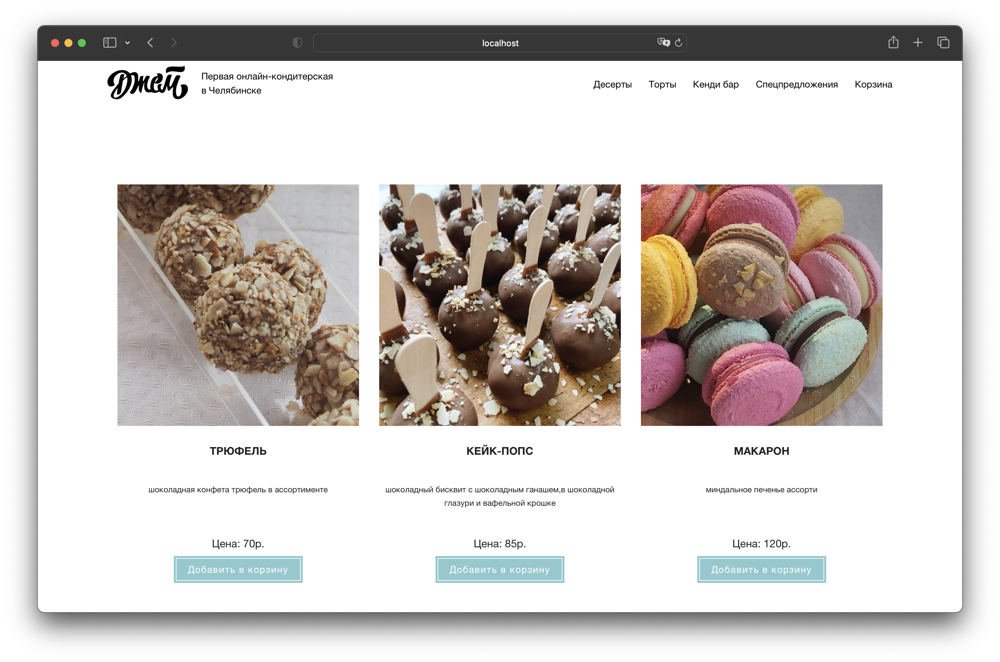

# Рекод интернет магазина Джем

<a href="http://imatte.ru">Live demo</a> (WORK IN PROGRESS)



## Описание

<p>В ~2014 году я сделал интернет магазин <a href="http://jamjars.ru">jamjars.ru</a> на <code>HTML, CSS, jQuery</code></p>
<p>В этом репозитории я делаю рекод этого проекта с использованием более современных инструментов.</p>

## Стэк

- Vue3 + Composition API
- Vuex
- Vue Router
- Vite
- Supabase (PostgreSQL, Storage, Auth)

## Структура проекта

- `src` - исходный код проекта
  - `assets` - статические файлы
  - `common` - общие компоненты
  - `components` - компоненты
  - `router` - роутер
  - `store` - vuex хранилище
  - `views` - страницы
  - `helpers` - вспомогательные функции
- `public` - статические файлы
- `dist` - собранный проект
- `package.json` - файл с зависимостями
- `vite.config.js` - конфигурация сборщика проекта

### Запуск проекта

```bash
# Установка зависимостей
yarn
# Установка токена для supabase (необходимо указать API URL и ANON KEY)
cp .env.example .env
# Запуск проекта
yarn dev
# Сборка проекта
yarn build
```
